# Roadmap Belajar CapCut untuk Video TikTok (30 Hari, AI Assist)

Belajar CapCut untuk TikTok paling efektif kalau urutannya begini: potong dulu, baru hias. Dengan AI (Auto Cut, auto caption, remove background), first pass jadi cepat. Yang tetap manual dan fundamental: **hook 3 detik**, **proofread caption**, **pacing**, **ducking audio**, dan **cek export di HP**.

**Target 30 hari (jalur AI):** latihan 60-90 menit/hari. Minggu 1: potong + caption dengan AI assist. Minggu 2: motion (keyframe, speed ramp) + visual. Minggu 3-4: polish, batch, publish. Di akhir bulan: batch 3 video ~60 menit dengan AI, plus skill lanjutan (remove BG, masking, motion tracking intro).

## Kenapa jalur ini cocok kalau pakai AI

AI CapCut bagus untuk:

- Auto Cut / scene detect (rough pass dead air)
- Auto captions (draft transcript)
- Remove background, enhance voice
- Template dan smart reframe

AI **tidak** mengganti:

- Keputusan hook dan pacing
- Proofread nama, istilah, timing caption
- Balance voice vs musik
- Cek safe zone dan file export di HP

## Kenapa CapCut cocok untuk TikTok

CapCut dibuat oleh tim yang sama dengan ekosistem ByteDance/TikTok. Versi mobile, desktop, dan web punya logika edit yang mirip, meski letak tombol bisa beda. Fitur yang paling sering dipakai creator short-form:

- Rasio 9:16
- Auto captions / auto subtitle
- Template tren
- Transisi, efek, filter, sticker
- Beat sync / musik royalty-free
- Export atau share langsung ke TikTok

Pilih platform belajar lebih dulu (Mobile / Desktop / Web). Tutorial yang mencampur ketiganya sering bikin bingung karena kontrolnya tidak identik. Untuk 30 hari, pilih **satu platform utama** (Mobile kalau mau posting cepat; Desktop kalau sering layer banyak).

## Prinsip belajar (jangan dibalik)

1. AI untuk first pass (Auto Cut, caption, remove BG). Kamu untuk hook, pacing, proofread.
2. Potong dead air: AI rough cut, lalu koreksi manual yang AI lewatkan.
3. Caption wajib dicek manual. AI sering salah nama, istilah, dan tanda baca.
4. Motion (keyframe, speed) dimulai minggu 2, bukan minggu 4.
5. Export uji file asli di HP. Jangan re-upload dari platform lain.

## Ringkasan fase (30 hari, AI assist)

| Fase | Hari | Fokus | Output latihan |
|------|------|-------|----------------|
| 0. Setup + AI map | 1 | Canvas 9:16, audit fitur AI | Tahu tool AI di buildmu |
| 1. Potong + AI cut | 2-5 | Auto Cut + hook/pacing manual | 1 video bersih 25-30 dtk |
| 2. AI caption + audio | 6-9 | Caption AI + proofread + ducking | Video subtitle + audio seimbang |
| 3. Motion & visual | 10-14 | Beat sync, keyframe, speed, template | Video dengan gerak + gaya |
| 4. Polish + gaya | 15-19 | Remove BG, stabilize, signature | 2 draft publish-ready |
| 5. Batch lanjutan | 20-30 | Timed workflow, batch, masking, ujian | 3 video ~60 mnt + checklist |

## Tree diagram breakdown materi

```mermaid
flowchart TD
  R["CapCut untuk TikTok - 30 hari"]

  R --> A["Dasar editor"]
  R --> B["Potong dan susun"]
  R --> C["Teks dan caption"]
  R --> D["Audio"]
  R --> E["Visual tren"]
  R --> F["Motion lanjutan"]
  R --> G["AI tools"]
  R --> H["Export dan TikTok"]

  A --> A1["Platform: Mobile, Desktop, Web"]
  A --> A2["Project canvas 9:16"]
  A --> A3["Media library dan import"]
  A --> A4["Timeline multi-track"]
  A --> A5["Preview dan undo"]

  B --> B1["Trim ujung klip"]
  B --> B2["Split dan hapus"]
  B --> B3["Jump cut, buang dead air"]
  B --> B4["Rearrange urutan"]
  B --> B5["Crop, transform, rotate"]
  B --> B6["Duplicate dan overlay track"]

  C --> C1["Auto captions"]
  C --> C2["Koreksi manual"]
  C --> C3["Style font, warna, shadow"]
  C --> C4["Safe zone TikTok UI"]
  C --> C5["Text overlay hook"]
  C --> C6["Text animation in atau out"]

  D --> D1["Musik CapCut atau impor"]
  D --> D2["Voiceover rekam"]
  D --> D3["Volume balance"]
  D --> D4["Fade in atau out"]
  D --> D5["Beat detection sync"]
  D --> D6["SFX pop atau whoosh"]

  E --> E1["Transitions"]
  E --> E2["Effects body atau lens"]
  E --> E3["Filters warna"]
  E --> E4["Stickers dan elements"]
  E --> E5["Templates trending"]
  E --> E6["Green screen atau cutout"]

  F --> F1["Keyframes posisi dan scale"]
  F --> F2["Speed ramp atau velocity"]
  F --> F3["Masking"]
  F --> F4["Motion tracking"]
  F --> F5["Stabilize"]
  F --> F6["Color adjust atau grading"]

  G --> G1["Auto cut atau scene detect"]
  G --> G2["Remove background"]
  G --> G3["Text to speech"]
  G --> G4["AI templates"]
  G --> G5["Enhance voice"]

  H --> H1["1080x1920 MP4"]
  H --> H2["30 atau 60 fps"]
  H --> H3["Share ke TikTok"]
  H --> H4["Cover atau thumbnail"]
  H --> H5["Cek di HP sebelum post"]
```

Ini peta materi (apa yang dipelajari), bukan jadwal harian. Urutan latihan ada di ringkasan fase di atas. Jalur AI memampatkan fase potong/caption dan memajukan motion ke minggu 2.

---

## Fase 0 - Setup + AI map (Hari 1)

### Yang dilakukan

- Buat project **9:16**, resolusi **1080x1920**.
- Audit fitur AI di buildmu: Auto Cut, Auto Captions, Remove BG, Enhance Voice.
- Siapkan folder `raw/`, `music/`, `export/` dan rekam 4-6 klip latihan.

### Referensi

- [CapCut features map](https://capcutguide.com/capcut-video-editor-features-guide/)
- [AI subtitles workflow](https://videocaptionstudio.com/blog/capcut-ai-subtitles-2025)
- [Auto Cut (resmi)](https://www.capcut.com/help/auto-cut-in-capcut)

### Checkpoint

Tahu tool AI mana yang tersedia di akun/platformmu.

---

## Fase 1 - Potong + AI cut (Hari 2-5)

### Skill wajib (fundamental, walau pakai AI)

- Auto Cut sebagai rough pass, bukan keputusan final
- Koreksi hook 3 detik manual
- Jump cut sisa jeda yang AI lewatkan
- Pacing: versi normal vs agresif
- Safe zone frame TikTok

### Latihan harian

| Hari | Latihan | Batas waktu |
|------|---------|-------------|
| 2 | Auto Cut rough pass + koreksi hook 3 detik | 60 mnt |
| 3 | Jump cut manual sisa jeda AI | 60 mnt |
| 4 | Dua versi pacing + export uji di HP | 75 mnt |
| 5 | Safe zone + video bersih tanpa efek | 45 mnt |

### Target fase 1

Satu video 25-30 detik bersih. Hook kuat. AI dipakai, tapi pacing dicek manual.

### Referensi

- [Auto Cut (resmi)](https://www.capcut.com/help/auto-cut-in-capcut)
- [Cut, trim & split (2026)](https://capcutguide.com/how-to-cut-trim-split-video-capcut/)
- [Export settings TikTok](https://capcutguide.com/capcut-export-settings/)

---

## Fase 2 - AI caption + audio (Hari 6-9)

### Skill wajib

- Generate caption setelah voice final
- Proofread nama, istilah, timing
- Preset caption merek
- Audio ducking / Dynamic Loudness
- Text overlay hook (layer manual)

### Latihan harian

| Hari | Latihan | Batas waktu |
|------|---------|-------------|
| 6 | AI caption + proofread transcript | 60 mnt |
| 7 | Preset caption merek | 45 mnt |
| 8 | Audio ducking | 60 mnt |
| 9 | Hook teks + multi-track lock + 1 draft | 60 mnt |

### Referensi

- [Auto captions CapCutGuide](https://capcutguide.com/capcut-auto-captions/)
- [AI subtitles workflow](https://videocaptionstudio.com/blog/capcut-ai-subtitles-2025)
- [Teks vs caption](https://capcutguide.com/how-to-add-text-in-capcut/)

---

## Fase 3 - Motion & visual (Hari 10-14)

Motion dimajukan ke minggu 2 karena cut/caption sudah dipercepat AI.

### Latihan harian

| Hari | Latihan | Batas waktu |
|------|---------|-------------|
| 10 | Beat sync + retensi tiap 3-5 dtk | 75 mnt |
| 11 | Keyframe zoom + animasi teks | 75 mnt |
| 12 | Speed ramp di beat | 60 mnt |
| 13 | Template tren deconstruct | 75 mnt |
| 14 | Transisi ringan + filter konsisten | 60 mnt |

### Referensi

- [Pro tips CapCut TikTok](https://www.freevisuals.net/post/secret-pro-tips-for-editing-tiktok-videos-with-capcut)
- [Fast workflow 2025](https://www.avramify.com/blogs/news/capcut-2025-fast-editing-workflows-for-viral-tiktoks)
- [Templates & trends 2026](https://www.capcut.com/help/templates-and-trends)

---

## Fase 4 - Polish + gaya (Hari 15-19)

### Latihan harian

| Hari | Latihan | Batas waktu |
|------|---------|-------------|
| 15 | Remove background AI + rapikan tepi | 75 mnt |
| 16 | B-roll + stabilize segmen | 75 mnt |
| 17 | Enhance voice + noise reduction | 60 mnt |
| 18 | Signature style (font + warna + 1 gerak) | 90 mnt |
| 19 | 2 video publish-ready (edukasi + tren) | 90 mnt |

### Referensi

- [Stabilize video](https://capcutguide.com/stabilize-video-capcut/)
- [CapCut advanced + AI (resmi)](https://www.capcut.com/resource/how-to-use-capcut)

---

## Fase 5 - Batch lanjutan (Hari 20-30)

### Latihan harian (ringkas)

| Hari | Latihan |
|------|---------|
| 20 | Workflow AI timed: 1 video <25 mnt |
| 21 | Batch 2 video |
| 22 | Batch 3 video ~60 mnt |
| 23 | Masking / cutout lanjutan |
| 24 | Smart reframe / auto resize |
| 25 | A/B hook test |
| 26 | Motion tracking intro |
| 27 | Publish + ukur watch time |
| 28 | Signature reel mini (5 clip) |
| 29 | Dry run checklist |
| 30 | Ujian: batch 3 video + checklist penuh |

### Referensi

- [Fast workflow 2025](https://www.avramify.com/blogs/news/capcut-2025-fast-editing-workflows-for-viral-tiktoks)
- [Creator Portal](https://www.capcut.com/partners/creator-portal)

---

## Setting export yang aman untuk TikTok

| Parameter | Saran awal |
|-----------|------------|
| Aspect ratio | 9:16 |
| Resolusi | 1080 x 1920 |
| Frame rate | 30 fps (aman) atau 60 fps (gerak halus) |
| Format | MP4 |
| Uji | Tonton di HP sebelum post |

Setelah export, cek juga:

- Caption tidak ketutup UI TikTok
- Audio tidak hilang setelah upload (kadang karena musik copyright di sisi TikTok, bukan bug CapCut)
- Hook terlihat jelas di 1-3 detik pertama

---

## Kalender 30 hari (AI assist, ringkas)

### Hari 1
Canvas 9:16 + audit fitur AI di akunmu.

### Hari 2-5
Auto Cut + hook/pacing manual + safe zone. Satu video bersih.

### Hari 6-9
AI caption + proofread + ducking + hook teks.

### Hari 10-14
Beat sync, keyframe, speed ramp, template deconstruct.

### Hari 15-19
Remove BG, stabilize, enhance voice, signature style, 2 draft.

### Hari 20-30
Timed workflow, batch 2-3 video, masking, A/B hook, publish, ujian.

---

## Checklist kompetensi (ujian mandiri Hari 30)

Lulus dengan AI assist + proofread manual:

- [ ] Auto Cut rough pass + koreksi hook 3 detik dalam 15 menit
- [ ] AI caption + proofread nama/istilah dalam 5 menit
- [ ] Ducking musik saat bicara
- [ ] Beat sync + 1 keyframe zoom/teks
- [ ] Speed ramp di beat, lalu kembali normal
- [ ] Remove background AI + rapikan tepi
- [ ] Signature style ke 3 video
- [ ] Batch 3 video dengan AI assist dalam ~60 menit
- [ ] Export 1080x1920 H.264, cek file asli di HP

---

## Jalur kursus (opsional, setelah self-practice)

Kalau mau struktur kelas formal setelah Fase 1-2:

- [Coursera: CapCut for Beginners Specialization](https://www.coursera.org/specializations/capcut-video-editing-for-beginners) - core editing → advanced tools → desktop untuk Reels & TikTok
- [CapCut Creator Portal](https://www.capcut.com/partners/creator-portal) - jalur Explorer / Emerging / Elite
- [CursoB CapCut learning paths](https://cursob.com/en/capcut-en/) - kumpulan path & tutorial gratis

Self-practice dulu tetap lebih penting dari nonton course panjang tanpa output.

---

## Kesalahan umum yang harus dihindari

1. Efek dulu, pacing belakangan.
2. Caption auto tanpa koreksi.
3. Teks menutup wajah atau tombol like/comment.
4. Musik terlalu kencang, voice tenggelam.
5. Belajar Mobile dari tutorial Desktop (atau sebaliknya) lalu panik karena tombol "hilang".
6. Pakai aset Pro tanpa sadar, gagal export.
7. Tidak pernah menonton hasil di HP.
8. Memaksa masking/motion tracking di minggu padat padahal basic belum kuat.

---

## Verifikasi sumber (Agustus 2026)

Semua sumber di bawah masuk jendela **2025-2026**. Ditambah panduan CapCutGuide per skill (cut, caption, export, stabilize) selain artikel resmi CapCut.

| Status | Jumlah | Catatan |
|--------|--------|---------|
| Lolos (tanggal publikasi/update jelas 2025-2026) | 16+ | Resmi CapCut, CapCutGuide deep-dive, Avramify, FreeVisuals |
| Lolos (kursus/hub hidup, konten 2025-2026) | 2 | Coursera; CursoB |

## Sumber

### Resmi CapCut

1. [Tutorial for beginners](https://www.capcut.com/resource/capcut-tutorial-for-beginners) - **21 Jan 2026**
2. [How to use CapCut](https://www.capcut.com/resource/how-to-use-capcut) - **17 Jun 2025**
3. [How to edit TikTok videos](https://www.capcut.com/resource/how-to-edit-tiktok-videos) - **31 Des 2025**
4. [Video editor guide](https://www.capcut.com/resource/capcut-video-editor-guide) - **25 Mar 2026**
5. [Creator Portal](https://www.capcut.com/partners/creator-portal) - portal hidup
6. [Templates & Trends](https://www.capcut.com/help/templates-and-trends) - artikel tren **Mar 2026**
7. [Auto Cut help](https://www.capcut.com/help/auto-cut-in-capcut) - resmi

### CapCutGuide (per skill)

8. [Learning path](https://capcutguide.com/capcut-tutorial/) - **5 Jul 2026**
9. [Cut, trim & split](https://capcutguide.com/how-to-cut-trim-split-video-capcut/) - **5 Agu 2026**
10. [Auto captions](https://capcutguide.com/capcut-auto-captions/) - **22 Jun 2026**
11. [Export settings TikTok/Reels/Shorts](https://capcutguide.com/capcut-export-settings/) - **22 Jun 2026**, fact-check **5 Agu 2026**
12. [Teks manual vs caption](https://capcutguide.com/how-to-add-text-in-capcut/) - **2 Agu 2026**
13. [Stabilize video](https://capcutguide.com/stabilize-video-capcut/) - **23 Jun 2026**
14. [Features map](https://capcutguide.com/capcut-video-editor-features-guide/) - **20 Mei 2026**

### Workflow & tips

15. [Fast CapCut workflows TikTok 2025](https://www.avramify.com/blogs/news/capcut-2025-fast-editing-workflows-for-viral-tiktoks) - **20 Jun 2025**
16. [Pro tips CapCut TikTok](https://www.freevisuals.net/post/secret-pro-tips-for-editing-tiktok-videos-with-capcut) - **1 Agu 2026**
17. [AI subtitles workflow](https://videocaptionstudio.com/blog/capcut-ai-subtitles-2025) - **29 Sep 2025**
18. [CapCut beginners 2026 (YouTube)](https://www.youtube.com/watch?v=j5_471mO14c) - **~10 Agu 2025**

### Kursus (opsional)

19. [Coursera CapCut for Beginners](https://www.coursera.org/specializations/capcut-video-editing-for-beginners) - modul **Des 2025 - Feb 2026**
20. [CursoB learning paths](https://cursob.com/en/capcut-en/) - kurasi tutorial **2025**

---

*Disusun Agustus 2026. Versi 30 hari AI assist. Fitur AI CapCut bisa beda per platform, region, akun, dan versi aplikasi.*
